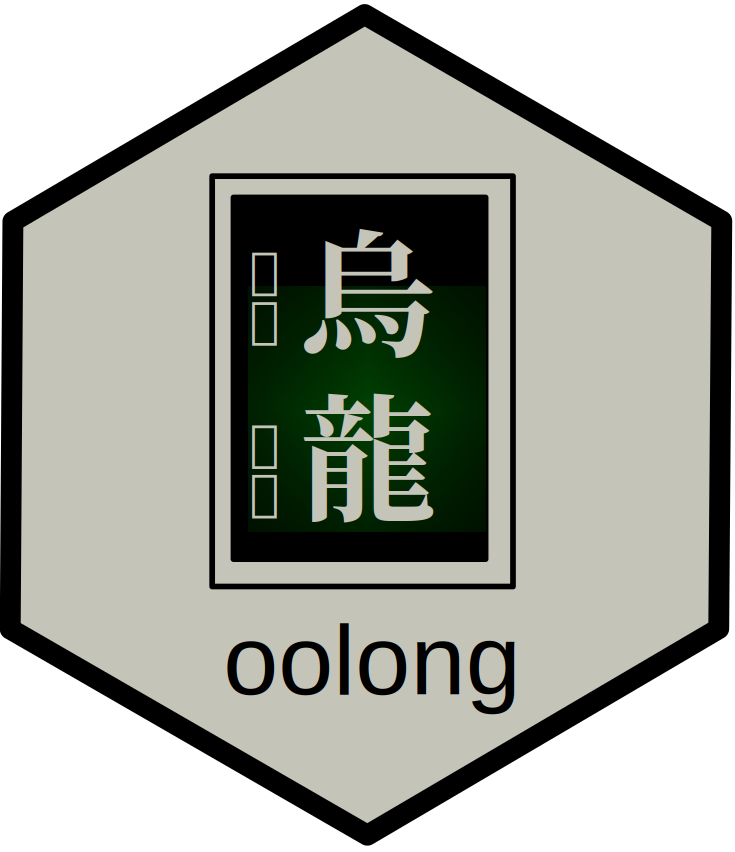

<!-- README.md is generated from README.Rmd. Please edit that file -->

```{r, include = FALSE}
knitr::opts_chunk$set(
  collapse = TRUE,
  comment = "#>",
  fig.path = "man/figures/README-",
  out.width = "100%"
  )
set.seed(42)
```

# oolong 

<!-- badges: start -->
[](https://codecov.io/gh/gesistsa/oolong?branch=v0.5)
[](https://joss.theoj.org/papers/6e535564e7142d705f4f3d68b18dac62)
[](https://CRAN.R-project.org/package=oolong)
<!-- badges: end -->


The goal of oolong ^[/ˈuːlʊŋ/ 烏龍, literally means "Dark Dragon", is a semi-oxidized tea from Asia. It is very popular in Taiwan, Japan and Hong Kong. In Cantonese and Taiwanese Mandarin, the same word can also mean "confused". It perfectly captures the spirit of human-in-the-loop validation. ] is to generate and administrate validation tests easily for typical automated content analysis tools such as topic models and dictionary-based tools.

Please refer to the [overview](overview_gh.md) for an introduction to this package. If you need to deploy the test online, please refer to the [Deployment Vignette](deploy_gh.md). If you use BTM, please refer to the [BTM Vignette](btm_gh.md).

## Citation

Please cite this package as:

Chan C-h. & Sältzer M., (2020). oolong: An R package for validating  automated content analysis tools. Journal of Open Source Software, 5(55), 2461, [https://doi.org/10.21105/joss.02461](https://doi.org/10.21105/joss.02461)

For a BibTeX entry, use the output from `citation(package = "oolong")`.

## Contributing

Contributions in the form of feedback, comments, code, and bug report are welcome.

* Fork the source code, modify, and issue a [pull request](https://docs.github.com/en/github/collaborating-with-issues-and-pull-requests/creating-a-pull-request-from-a-fork).
* Issues, bug reports: [File a Github issue](https://github.com/chainsawriot/oolong).
* Github is not your thing? Contact Chung-hong Chan by e-mail, post, or other methods listed on this [page](https://www.mzes.uni-mannheim.de/d7/en/profiles/chung-hong-chan).

## Code of Conduct

Please note that the oolong project is released with a [Contributor Code of Conduct](https://contributor-covenant.org/version/2/0/CODE_OF_CONDUCT.html). By contributing to this project, you agree to abide by its terms.

---
