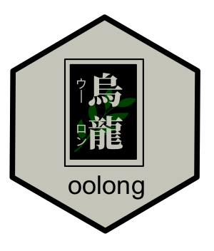

<!-- README.md is generated from README.Rmd. Please edit that file -->

```{r, include = FALSE}
knitr::opts_chunk$set(
  collapse = TRUE,
  comment = "#>",
  fig.path = "man/figures/README-",
  out.width = "100%"
  )
set.seed(42)
```

# oolong 

<!-- badges: start -->
<!-- badges: end -->

The goal of oolong ^[/ˈuːlʊŋ/ 烏龍, literally means "Dark Dragon", is a semi-oxidized tea from Asia. It is very popular in Taiwan, Japan and Hong Kong] is to generate and administrate validation tests easily for typical automated content analysis tools such as topic models and dictionary-based tools.

## Installation

You can install the development version from [GitHub](https://github.com/) with:

``` r
# install.packages("devtools")
devtools::install_github("chainsawriot/oolong")
```

## Example

### Word intrusion test

`newsgroup_stm` is an example topic model trained with the data `newsgroup5` using the `stm` package. Currently, this package supports structural topic models / correlated topic models from `stm`, Warp LDA models from `text2vec` and LDA/CTM models from `topicmodels`.

```{r example}
library(oolong)
library(stm)
newsgroup_stm
```

To create an oolong test, use the function `create_oolong_test`.

```{r createtest}
oolong_test <- create_oolong(newsgroup_stm)
oolong_test
```

As instructed, use the method `$do_word_intrusion_test()` to start coding. 

```{r, eval = FALSE}
oolong_test$do_word_intrusion_test()
```

If you are running this in RStudio, you should see a test screen similar to this:


After the coding, you need to first lock the test. Then, you can look at the model precision by printing the oolong test.

```{r, include = FALSE}
### Mock this process
oolong_test$.__enclos_env__$private$test_content$word$answer <- oolong_test$.__enclos_env__$private$test_content$word$intruder
oolong_test$.__enclos_env__$private$test_content$word$answer[1] <- "wronganswer"
```

```{r lock}
oolong_test$lock()
oolong_test
```

### Topic intrusion test

For example, `newsgroup_stm` was generated with the corpus `newsgroup5$text`

```{r newgroup5}
library(tibble)
newsgroup5
```

Creating the oolong test object with the corpus used for training the topic model will generate topic intrusion test cases. 

```{r createtest2}
oolong_test <- create_oolong(newsgroup_stm, newsgroup5$text)
oolong_test
```

Similarly, use the `$do_topic_intrusion_test` to code the test cases, lock the test with `$lock()` and then you can look at the TLO (topic log odds) value by printing the oolong test.

```{r, eval = FALSE}
oolong_test$do_topic_intrusion_test()
oolong_test$lock()
```

```{r, include = FALSE}
genius_topic <- function(obj1) {
    obj1$.__enclos_env__$private$test_content$topic$answer <- obj1$.__enclos_env__$private$test_content$topic$intruder
    return(obj1)
}
genius_word <- function(obj1) {
    obj1$.__enclos_env__$private$test_content$word$answer <- obj1$.__enclos_env__$private$test_content$word$intruder
    return(obj1)
}
oolong_test <- genius_word(genius_topic(oolong_test))
oolong_test$.__enclos_env__$private$test_content$topic$answer[2] <- sample(oolong_test$.__enclos_env__$private$test_content$topic$candidates[[2]], 1)
oolong_test$lock()
```

```{r topic_res}
oolong_test
```

## Suggested workflow

The test makes more sense if more than one coder is involved. A suggested workflow is to create the test, then clone the oolong object. Ask multiple coders to do the test(s) and then summarize the results.

Train a topic model.

```{r step0, eval = FALSE}
require(quanteda)
require(stm)
dfm(newsgroup5$text, tolower = TRUE, stem = TRUE, remove = stopwords('english'), remove_punct = TRUE, remove_numbers = TRUE, remove_symbols = TRUE, remove_hyphens = TRUE) %>% dfm_trim(min_docfreq = 5, max_docfreq = 1000) %>% dfm_select(min_nchar = 3, pattern = "^[a-zA-Z]+$", valuetype = "regex") -> newsgroup5_dfm
docvars(newsgroup5_dfm, "title") <- newsgroup5$title
newsgroup5_dfm %>% convert(to = "stm", omit_empty = FALSE) -> newsgroup5_stm
newsgroup_stm <- stm(newsgroup5_stm$documents, newsgroup5_stm$vocab, data =newsgroup5_stm$meta, K = 10, seed = 42)
```

Create a new oolong object.

```{r step1}
oolong_test_rater1 <- create_oolong(newsgroup_stm)
```

Clone the oolong object to be used by other raters.

```{r step2}
oolong_test_rater2 <- clone_oolong(oolong_test_rater1)
```

Ask different coders to code each object and then lock the object.

```{r, eval = FALSE}
## Let rater 1 do the test.
oolong_test_rater1$do_word_intrusion_test()
oolong_test_rater1$lock()

## Let rater 2 do the test.
oolong_test_rater2$do_word_intrusion_test()
oolong_test_rater2$lock()
```

```{r, include = FALSE}
### Mock this process
oolong_test_rater1$.__enclos_env__$private$test_content$word$answer <- oolong_test_rater1$.__enclos_env__$private$test_content$word$intruder
oolong_test_rater1$lock()
oolong_test_rater2$.__enclos_env__$private$test_content$word$answer <- oolong_test_rater2$.__enclos_env__$private$test_content$word$intruder
oolong_test_rater2$.__enclos_env__$private$test_content$word$answer[1] <- "wronganswer"
oolong_test_rater2$lock()
```

Get a summary of the two objects.

```{r, step3}
summarize_oolong(oolong_test_rater1, oolong_test_rater2)
```

## About Warp LDA

There is a subtle difference between the support for `stm` and for `text2vec`.

`newsgroup_warplda` is a Warp LDA object trained with the same dataset as the `newsgroup_stm`

```{r warplda}
newsgroup_warplda
```

All the API endpoints are the same, except the one for the creation of topic intrusion test cases. You must supply also the `input_dfm`.

```{r warplda2}
### Just word intrusion test.
oolong_test <- create_oolong(newsgroup_warplda)
oolong_test
```


```{r warplda3}
newsgroup5_dfm
```

```{r warplda4}
oolong_test <- create_oolong(newsgroup_warplda, newsgroup5$text, input_dfm = newsgroup5_dfm)
oolong_test
```

## References

1. Chang, J., Gerrish, S., Wang, C., Boyd-Graber, J. L., & Blei, D. M. (2009). Reading tea leaves: How humans interpret topic models. In Advances in neural information processing systems (pp. 288-296).

---
