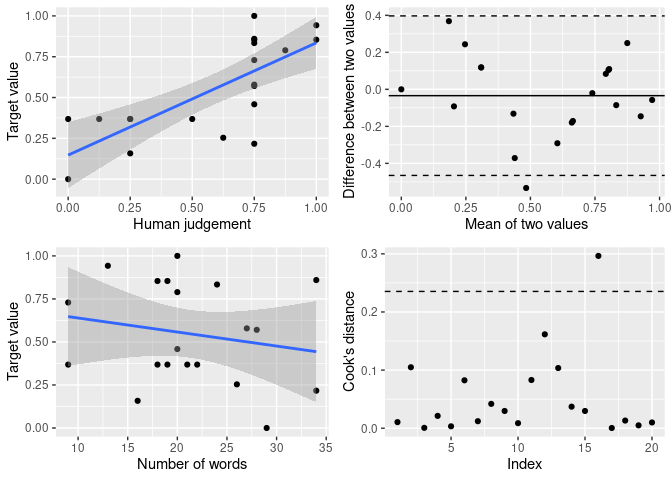

<!-- README.md is generated from README.Rmd. Please edit that file -->
oolong 
===========================================================================

<!-- badges: start -->
<!-- badges: end -->
The goal of oolong [1] is to generate and administrate validation tests easily for typical automated content analysis tools such as topic models and dictionary-based tools.

The validation test is called "oolong test" (for reading tea leaves). Creating oolong test for topic models and dictionary-based uses the same function: `create_oolong()`. The most important parameters are `input_model` and `input_corpus`. Setting each of them to `NULL` generates different tests.

<table>
<colgroup>
<col width="8%" />
<col width="9%" />
<col width="82%" />
</colgroup>
<thead>
<tr class="header">
<th>input_model</th>
<th align="center">input_corpus</th>
<th>output</th>
</tr>
</thead>
<tbody>
<tr class="odd">
<td>Not NULL</td>
<td align="center">NULL</td>
<td>oolong test for validating a topic model with <a href="#word-intrusion-test">word intrusion test</a></td>
</tr>
<tr class="even">
<td>Not NULL</td>
<td align="center">Not NULL</td>
<td>oolong test for validating a topic model with <a href="#word-intrusion-test">word intrusion test</a> and <a href="#topic-intrusion-test">topic intrusion test</a></td>
</tr>
<tr class="odd">
<td>NULL</td>
<td align="center">Not NULL</td>
<td>oolong test for <a href="#creating-gold-standard">creating gold standard</a></td>
</tr>
<tr class="even">
<td>NULL</td>
<td align="center">NULL</td>
<td>error</td>
</tr>
</tbody>
</table>

Installation
------------

You can install the development version from [GitHub](https://github.com/) with:

``` r
# install.packages("devtools")
devtools::install_github("chainsawriot/oolong")
```

Validating Topic Models
-----------------------

#### Word intrusion test

`newsgroup_stm` is an example topic model trained with the data `newsgroup5` using the `stm` package. Currently, this package supports structural topic models / correlated topic models from `stm`, Warp LDA models from `text2vec` and LDA/CTM models from `topicmodels`.

    #> stm v1.3.5 successfully loaded. See ?stm for help. 
    #>  Papers, resources, and other materials at structuraltopicmodel.com
    #> Package version: 2.0.0
    #> Parallel computing: 2 of 4 threads used.
    #> See https://quanteda.io for tutorials and examples.
    #> 
    #> Attaching package: 'quanteda'
    #> The following object is masked from 'package:utils':
    #> 
    #>     View
    #> 
    #> Attaching package: 'dplyr'
    #> The following objects are masked from 'package:stats':
    #> 
    #>     filter, lag
    #> The following objects are masked from 'package:base':
    #> 
    #>     intersect, setdiff, setequal, union

``` r
newsgroup_stm
#> A topic model with 10 topics, 4182 documents and a 8920 word dictionary.
```

To create an oolong test, use the function `create_oolong_test`.

``` r
oolong_test <- create_oolong(newsgroup_stm)
oolong_test
#> An oolong test object with k = 10, 0 coded.
#> Use the method $do_word_intrusion_test() to do word intrusion test.
#> Use the method $lock() to finalize this object and see the results.
```

As instructed, use the method `$do_word_intrusion_test()` to start coding.

``` r
oolong_test$do_word_intrusion_test()
```

If you are running this in RStudio, you should see a test screen similar to this:


After the coding, you need to first lock the test. Then, you can look at the model precision by printing the oolong test.

``` r
oolong_test$lock()
oolong_test
#> An oolong test object with k = 10, 10 coded.
#> 90%  precision
```

#### Topic intrusion test

For example, `newsgroup_stm` was generated with the corpus `newsgroup5$text`

``` r
library(tibble)
newsgroup5
#> # A tibble: 4,182 x 3
#>    text                                                  title            ntoken
#>    <chr>                                                 <chr>             <int>
#>  1 "\nI agree.  So why is Cylink the only (and expensiv… sci.crypt           302
#>  2 "[This is a co-authored report from two of us who we… talk.politics.g…   2900
#>  3 "\njubilee, Pope >Leo the 12th had a medallion cast … soc.religion.ch…    463
#>  4 "\n\nAnd the 'Turkish Karabag' is next. As for 'Cypr… talk.politics.m…    929
#>  5 "The subject says what I would like to do, here are … comp.sys.mac.ha…    218
#>  6 "\n\n\n\nAre you related to 'Arromdian' of ASALA/SDP… talk.politics.m…    920
#>  7 "\n#Rick Anderson replied to my letter with...\n#\n#… talk.religion.m…   1760
#>  8 "                                      ^^^^^^\nNo ar… rec.sport.baseb…    302
#>  9 "\nWhy thanks for your reply to my post.  By the way… talk.politics.g…    158
#> 10 " >When some types of client windows are displayed, … comp.windows.x      158
#> # … with 4,172 more rows
```

Creating the oolong test object with the corpus used for training the topic model will generate topic intrusion test cases.

``` r
oolong_test <- create_oolong(newsgroup_stm, newsgroup5$text)
oolong_test
#> An oolong test object with k = 10, 0 coded.
#> Use the method $do_word_intrusion_test() to do word intrusion test.
#> With 41 cases of topic intrusion test. 0 coded.
#> Use the method $do_topic_intrusion_test() to do topic intrusion test.
#> Use the method $lock() to finalize this object and see the results.
```

Similarly, use the `$do_topic_intrusion_test` to code the test cases, lock the test with `$lock()` and then you can look at the TLO (topic log odds) value by printing the oolong test.

``` r
oolong_test$do_topic_intrusion_test()
oolong_test$lock()
```

``` r
oolong_test
#> An oolong test object with k = 10, 10 coded.
#> 100%  precision
#> With 41 cases of topic intrusion test. 41 coded.
#> TLO: -0.019
```

### Suggested workflow

The test makes more sense if more than one coder is involved. A suggested workflow is to create the test, then clone the oolong object. Ask multiple coders to do the test(s) and then summarize the results.

Train a topic model.

``` r
dfm(newsgroup5$text, tolower = TRUE, stem = TRUE, remove = stopwords('english'), remove_punct = TRUE, remove_numbers = TRUE, remove_symbols = TRUE, remove_hyphens = TRUE) %>% dfm_trim(min_docfreq = 5, max_docfreq = 1000) %>% dfm_select(min_nchar = 3, pattern = "^[a-zA-Z]+$", valuetype = "regex") -> newsgroup5_dfm
docvars(newsgroup5_dfm, "title") <- newsgroup5$title
newsgroup5_dfm %>% convert(to = "stm", omit_empty = FALSE) -> newsgroup5_stm
newsgroup_stm <- stm(newsgroup5_stm$documents, newsgroup5_stm$vocab, data =newsgroup5_stm$meta, K = 10, seed = 42)
```

Create a new oolong object.

``` r
oolong_test_rater1 <- create_oolong(newsgroup_stm, newsgroup5$text)
```

Clone the oolong object to be used by other raters.

``` r
oolong_test_rater2 <- clone_oolong(oolong_test_rater1)
```

Ask different coders to code each object and then lock the object.

``` r
## Let rater 1 do the test.
oolong_test_rater1$do_word_intrusion_test()
oolong_test_rater1$do_topic_intrusion_test()
oolong_test_rater1$lock()

## Let rater 2 do the test.
oolong_test_rater2$do_word_intrusion_test()
oolong_test_rater2$do_topic_intrusion_test()
oolong_test_rater2$lock()
```

Get a summary of the two objects.

``` r
summarize_oolong(oolong_test_rater1, oolong_test_rater2)
#> Mean model precision: 0.25
#> Quantiles of model precision: 0.1, 0.175, 0.25, 0.325, 0.4
#> P-value of the model precision (H0: Model precision is not better than random guess): 0.224470246788736
#> Krippendorff's alpha: 0.24
#> K Precision: 0, 0.5, 1, 0, 0, 0, 0, 0.5, 0, 0.5
#> Mean TLO: -2.32
#> Median TLO: -2.06
#> Quantiles of TLO: -9.02803350279604, -3.67855193382253, -2.05776648588221, 0, 0
#> P-Value of the median TLO (H0: Median TLO is not better than random guess): 0.0273333333333333
```

### About the p-values

The test for model precision (MP) is based on an one-tailed, one-sample binomial test for each rater. In a multiple-rater situation, the p-values from all raters are combined using the Fisher's method (a.k.a. Fisher's omnibus test).

H0: MP is not better than 1/ n\_top\_terms

H1: MP is better than 1/ n\_top\_terms

The test for the median of TLO is based on a permutation test.

H0: Median TLO is not better than random guess.

H1: Median TLO is better than random guess.

One must notice that the two statistical tests are testing the bear minimum. A significant test only indicates the topic model can make the rater(s) perform better than random guess. It is not an indication of good topic interpretability. Also, one should use a very conservative significant level, e.g. *α* &lt; 0.001.

### About Warp LDA

There is a subtle difference between the support for `stm` and for `text2vec`.

`newsgroup_warplda` is a Warp LDA object trained with the same dataset as the `newsgroup_stm`

``` r
newsgroup_warplda
#> <WarpLDA>
#>   Inherits from: <LDA>
#>   Public:
#>     clone: function (deep = FALSE) 
#>     components: 0 91 0 0 2 0 260 0 83 27 0 0 26 96 24 0 0 0 37 0 0 10 14 ...
#>     fit_transform: function (x, n_iter = 1000, convergence_tol = 0.001, n_check_convergence = 10, 
#>     get_top_words: function (n = 10, topic_number = 1L:private$n_topics, lambda = 1) 
#>     initialize: function (n_topics = 10L, doc_topic_prior = 50/n_topics, topic_word_prior = 1/n_topics, 
#>     plot: function (lambda.step = 0.1, reorder.topics = FALSE, doc_len = private$doc_len, 
#>     topic_word_distribution: 0 0.000858992995903264 0 0 3.24680595464212e-05 0 0.0022 ...
#>     transform: function (x, n_iter = 1000, convergence_tol = 0.001, n_check_convergence = 10, 
#>   Private:
#>     calc_pseudo_loglikelihood: function (ptr = private$ptr) 
#>     check_convert_input: function (x) 
#>     components_: 0 91 0 0 2 0 260 0 83 27 0 0 26 96 24 0 0 0 37 0 0 10 14 ...
#>     doc_len: 96 1016 142 401 55 364 548 89 48 66 109 61 88 82 163 67  ...
#>     doc_topic_distribution: function () 
#>     doc_topic_distribution_with_prior: function () 
#>     doc_topic_matrix: 0 563 186 343 16 343 1075 7 0 0 236 135 1 0 0 56 0 8 8 4 ...
#>     doc_topic_prior: 0.1
#>     fit_transform_internal: function (model_ptr, n_iter, convergence_tol, n_check_convergence, 
#>     get_c_all: function () 
#>     get_c_all_local: function () 
#>     get_doc_topic_matrix: function (prt, nr) 
#>     get_topic_word_count: function () 
#>     init_model_dtm: function (x, ptr = private$ptr) 
#>     internal_matrix_formats: list
#>     is_initialized: FALSE
#>     n_iter_inference: 10
#>     n_topics: 10
#>     ptr: externalptr
#>     reset_c_local: function () 
#>     run_iter_doc: function (update_topics = TRUE, ptr = private$ptr) 
#>     run_iter_word: function (update_topics = TRUE, ptr = private$ptr) 
#>     seeds: 1281647796.30637 1224775350.35934
#>     set_c_all: function (x) 
#>     set_internal_matrix_formats: function (sparse = NULL, dense = NULL) 
#>     topic_word_distribution_with_prior: function () 
#>     topic_word_prior: 0.01
#>     transform_internal: function (x, n_iter = 1000, convergence_tol = 0.001, n_check_convergence = 10, 
#>     vocabulary: agre expens game town note great boss doubl salari buy b ...
```

All the API endpoints are the same, except the one for the creation of topic intrusion test cases. You must supply also the `input_dfm`.

``` r
### Just word intrusion test.
oolong_test <- create_oolong(newsgroup_warplda)
oolong_test
#> An oolong test object with k = 10, 0 coded.
#> Use the method $do_word_intrusion_test() to do word intrusion test.
#> Use the method $lock() to finalize this object and see the results.
```

``` r
newsgroup5_dfm
#> Document-feature matrix of: 4,182 documents, 8,920 features (98.9% sparse) and 1 docvar.
#>        features
#> docs    agre expens game town note great boss doubl salari buy
#>   text1    1      1    1    1    2     2    1     1      1   2
#>   text2    1      0    1    0    7     1    0     0      0   4
#>   text3    0      0    0    0    0     3    0     0      0   0
#>   text4    0      0    0    0    0     1    0     0      0   0
#>   text5    0      0    0    0    0     0    0     0      0   0
#>   text6    0      0    0    1    0     0    0     0      0   0
#> [ reached max_ndoc ... 4,176 more documents, reached max_nfeat ... 8,910 more features ]
```

``` r
oolong_test <- create_oolong(newsgroup_warplda, newsgroup5$text, input_dfm = newsgroup5_dfm)
#> INFO  [12:53:51.837] early stopping at 20 iteration
#> Warning in res[setdiff(1:length_test_items, position)] <- sample(good_terms):
#> number of items to replace is not a multiple of replacement length
oolong_test
#> An oolong test object with k = 10, 0 coded.
#> Use the method $do_word_intrusion_test() to do word intrusion test.
#> With 41 cases of topic intrusion test. 0 coded.
#> Use the method $do_topic_intrusion_test() to do topic intrusion test.
#> Use the method $lock() to finalize this object and see the results.
```

Validating Dictionary-based Methods
-----------------------------------

### Creating gold standard

`trump2k` is a dataset of 2,000 tweets from @realdonaldtrump.

``` r
tibble(text = trump2k)
#> # A tibble: 2,000 x 1
#>    text                                                                         
#>    <chr>                                                                        
#>  1 "In just out book, Secret Service Agent Gary Byrne doesn't believe that Croo…
#>  2 "Hillary Clinton has announced that she is letting her husband out to campai…
#>  3 "\"@TheBrodyFile: Always great to visit with  @TheBrodyFile one-on-one with …
#>  4 "Explain to @brithume and @megynkelly, who know nothing, that I will beat Hi…
#>  5 "Nobody beats me on National Security. \nhttps://t.co/sCrj4Ha1I5"            
#>  6 "\"@realbill2016: @realDonaldTrump @Brainykid2010 @shl Trump leading LA Time…
#>  7 "\"@teapartynews: Trump Wins Tea Party Group's 'Nashville Straw Poll' - News…
#>  8 "Big Republican Dinner tonight at Mar-a-Lago in Palm Beach. I will be there!"
#>  9 ".@HillaryClinton loves to lie. America has had enough of the CLINTON'S! It …
#> 10 "\"@brianstoya: @realDonaldTrump For POTUS #2016\""                          
#> # … with 1,990 more rows
```

For example, you are interested in studying the sentiment of these tweets. One can use tools such as AFINN to automatically extract sentiment in these tweets. However, oolong recommends to generate gold standard by human coding first using a subset. By default, oolong selects 1% of the origin corpus as test cases. The parameter `construct` should be an adjective, e.g. positive, liberal, populistic, etc.

``` r
oolong_test <- create_oolong(input_corpus = trump2k, construct = "positive")
oolong_test
#> An oolong test object (gold standard generation) with 20 cases, 0 coded.
#> Use the method $do_gold_standard_test() to generate gold standard.
#> Use the method $lock() to finalize this object and see the results.
```

As instructed, use the method `$do_gold_standard_test()` to start coding.

``` r
oolong_test$do_gold_standard_test()
```

The test screen should be similar to this:


After the coding, you need to first lock the test and then the `$turn_gold()` method is available.

``` r
oolong_test$lock()
oolong_test
#> An oolong test object (gold standard generation) with 20 cases, 20 coded.
#> Use the method $turn_gold() to convert the test results into a quanteda corpus.
```

### Example: Validating AFINN using the gold standard

A locked oolong test can be converted into a quanteda-compatible corpus for further analysis. The corpus contains two `docvars`, 'answer' and 'target\_value'.

``` r
oolong_test$turn_gold()
#> Corpus consisting of 20 documents and 2 docvars.
#> Access the answer from the coding with quanteda::docvars(obj, 'answer')
#> Put back the test score you would like to validate into quanteda::docvars(obj, 'target_value')
```

As instructed, put back the score you would like to validate into the `docvars` "target\_value". In this example, we calculate the AFINN score for each tweet using quanteda. The dictionary `afinn` is bundle with this package.

``` r
gold_standard <- oolong_test$turn_gold()
dfm(gold_standard, remove_punct = TRUE) %>% dfm_lookup(afinn) %>% quanteda::convert(to = "data.frame") %>%
    mutate(matching_word_valence = (neg5 * -5) + (neg4 * -4) + (neg3 * -3) + (neg2 * -2) + (neg1 * -1)
           + (zero * 0) + (pos1 * 1) + (pos2 * 2) + (pos3 * 3) + (pos4 * 4) + (pos5 * 5),
           base = ntoken(gold_standard, remove_punct = TRUE), afinn_score = matching_word_valence / base) %>%
    pull(afinn_score) -> all_afinn_score
all_afinn_score
#>       text1       text2       text3       text4       text5       text6 
#>  0.29411765 -0.09090909 -0.16666667  0.38461538  0.00000000  0.00000000 
#>       text7       text8       text9      text10      text11      text12 
#>  0.16666667  0.38461538  0.00000000  0.38461538 -0.29166667  0.00000000 
#>      text13      text14      text15      text16      text17      text18 
#>  0.50000000  0.07142857  0.00000000 -0.12000000  0.22222222  0.16000000 
#>      text19      text20 
#>  0.33333333  0.38888889
```

Put back the vector of AFINN score into the respective `docvars` and study the correlation between the gold standard and AFINN.

``` r
docvars(gold_standard, "target_value") <- all_afinn_score
summarize_gold_standard(gold_standard)
#> [1] 0.7097023
```

### Suggested workflow

Create an oolong object, clone it for another coder. According to Song et al. (Forthcoming), you should at least draw 1% of your data.

``` r
trump <- create_oolong(input_corpus = trump2k, exact_n = 40)
trump2 <- clone_oolong(trump)
```

Instruct two coders to code the tweets and lock the objects.

``` r
trump$do_gold_standard_test()
trump2$do_gold_standard_test()
trump$lock()
trump2$lock()
```

Calculate the target value (in this case, the AFINN score) by turning one object into a corpus.

``` r
gold_standard <- trump$turn_gold()
dfm(gold_standard, remove_punct = TRUE) %>% dfm_lookup(afinn) %>% quanteda::convert(to = "data.frame") %>%
    mutate(matching_word_valence = (neg5 * -5) + (neg4 * -4) + (neg3 * -3) + (neg2 * -2) + (neg1 * -1)
           + (zero * 0) + (pos1 * 1) + (pos2 * 2) + (pos3 * 3) + (pos4 * 4) + (pos5 * 5),
           base = ntoken(gold_standard, remove_punct = TRUE), afinn_score = matching_word_valence / base) %>%
    pull(afinn_score) -> target_value
```

Summarize all oolong objects with the target value.

``` r
res <- summarize_oolong(trump, trump2, target_value = target_value)
```

Read the results. The diagnostic plot consists of 4 subplots. It is a good idea to read Bland & Altman (1986) on the difference between correlation and agreement.

-   Subplot (top left): Raw correlation between human judgement and target value. One should want to have a good correlation between the two.
-   Subplot (top right): Bland-Altman plot. One should want to have no correlation. Also, the dots should be randomly scattering around the mean value. If it is so, the two measurements (human judgement and target value) are in good agreement.
-   Subplot (bottom left): Raw correlation between target value and content length. One should want to have no correlation, as an indication of good reliability against the influence of content length. (See Chan et al.)
-   Subplot (bottom right): Cook's distance of all data point. One should want to have no dot (or at least very few dots) above the threshold. It is an indication of how the raw correlation between human judgement and target value can or cannot be influenced by extreme values in your data.

The textual output contains the Krippendorff's alpha of the codings by your raters. In order to claim validity of your target value, you must first establish the reliability of your gold standard. Song et al. \[Forthcoming\] suggest Krippendorff's Alpha &gt; 0.7 as an acceptable cut-off.

``` r
res
#> Krippendorff's Alpha: 0.741139871924503
#> Correlation: 0.559 (p = 0)
#> Effect of content length: 0.067 (p = 0.683)
```

``` r
plot(res)
```



### Inadvisable workflow

*NOTE: This workflow is not recommended!*

This workflow violates the "validation first" principle. You can supply the `target_value` at the creation of oolong test.

``` r
dfm(trump2k, remove_punct = TRUE) %>% dfm_lookup(afinn) %>% quanteda::convert(to = "data.frame") %>%
    mutate(matching_word_valence = (neg5 * -5) + (neg4 * -4) + (neg3 * -3) + (neg2 * -2) + (neg1 * -1)
           + (zero * 0) + (pos1 * 1) + (pos2 * 2) + (pos3 * 3) + (pos4 * 4) + (pos5 * 5),
           base = ntoken(trump2k, remove_punct = TRUE), afinn_score = matching_word_valence / base) %>%
    pull(afinn_score) -> trump2k_afinn_score
oolong_test <- create_oolong(input_corpus = trump2k, construct = "positive", target_value = trump2k_afinn_score)
#> Warning in .generate_gold_standard(input_corpus, exact_n, frac, target_value):
#> Specifying target_value before coding is not recommended.
oolong_test
#> An oolong test object (gold standard generation) with 20 cases, 0 coded.
#> Use the method $do_gold_standard_test() to generate gold standard.
#> Use the method $lock() to finalize this object and see the results.
```

``` r
oolong_test$do_gold_standard_test()
```

``` r
oolong_test$lock()
gold_standard <- oolong_test$turn_gold()
docvars(gold_standard, "target_value")
#>  [1]  0.17647059  0.08333333  0.16666667  0.00000000  0.00000000 -0.11764706
#>  [7]  0.00000000  0.00000000 -0.14285714 -0.15000000  0.00000000 -0.36363636
#> [13]  0.09523810  0.23529412  0.18181818  0.00000000  0.22222222  0.05263158
#> [19]  0.28571429  0.05555556
```

``` r
summarize_gold_standard(gold_standard)
#> [1] 0.2635675
```

References
----------

1.  Chang, J., Gerrish, S., Wang, C., Boyd-Graber, J. L., & Blei, D. M. (2009). Reading tea leaves: How humans interpret topic models. In Advances in neural information processing systems (pp. 288-296).
2.  Song et al. (2020) In validations we trust? The impact of imperfect human annotations as a gold standard on the quality of validation of automated content analysis. Political Communication. [link](http://www.hyunjinsong.com/supplements/PC_Song_et_al_2020.pdf)
3.  Bland, J. M., & Altman, D. (1986). Statistical methods for assessing agreement between two methods of clinical measurement. The lancet, 327(8476), 307-310.
4.  Chan et al. (2020) It is not listed here, because it is still under review. Do it faster! Reviewers!

------------------------------------------------------------------------

[1] /ˈuːlʊŋ/ 烏龍, literally means "Dark Dragon", is a semi-oxidized tea from Asia. It is very popular in Taiwan, Japan and Hong Kong
