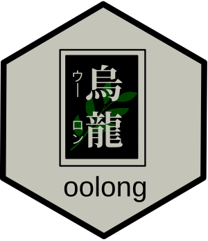
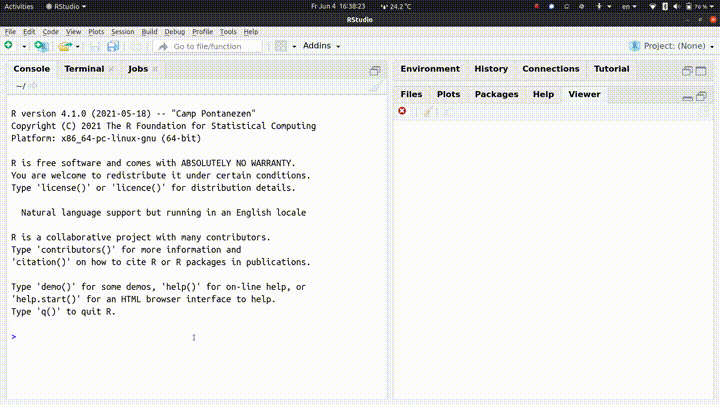

# oolong 

The goal of oolong \[1\] is to generate and administrate validation
tests easily for typical automated content analysis tools such as topic
models and dictionary-based tools.

Please refer to the
[overview](https://gesistsa.github.io/oolong/articles/overview.html) for
an introduction to this package. If you need to deploy the test online,
please refer to the [Deployment
Vignette](https://gesistsa.github.io/oolong/articles/deploy.html). If
you use BTM, please refer to the [BTM
Vignette](https://gesistsa.github.io/oolong/articles/btm.html).

## Citation

Please cite this package as:

Chan C-h. & Sältzer M., (2020). oolong: An R package for validating
automated content analysis tools. Journal of Open Source Software,
5(55), 2461, <https://doi.org/10.21105/joss.02461>

For a BibTeX entry, use the output from `citation(package = "oolong")`.

## Contributing

Contributions in the form of feedback, comments, code, and bug report
are welcome.

- Fork the source code, modify, and issue a [pull
  request](https://docs.github.com/en/github/collaborating-with-issues-and-pull-requests/creating-a-pull-request-from-a-fork).
- Issues, bug reports: [File a Github
  issue](https://github.com/chainsawriot/oolong).

## Code of Conduct

Please note that the oolong project is released with a [Contributor Code
of
Conduct](https://contributor-covenant.org/version/2/0/CODE_OF_CONDUCT.html).
By contributing to this project, you agree to abide by its terms.

------------------------------------------------------------------------

1.  /ˈuːlʊŋ/ 烏龍, literally means “Dark Dragon”, is a semi-oxidized tea
    from Asia. It is very popular in Taiwan, Japan and Hong Kong. In
    Cantonese and Taiwanese Mandarin, the same word can also mean
    “confused”. It perfectly captures the spirit of human-in-the-loop
    validation.
