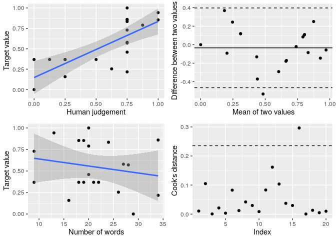

Overview
================
Chung-hong Chan

The validation test is called “oolong test” (for reading tea leaves).
This package provides several functions for generating different types
of oolong test.

| function | purpose                                                                                                                                  |
| -------: | :--------------------------------------------------------------------------------------------------------------------------------------- |
|   `wi()` | validating a topic model with [word intrusion test](#word-intrusion-test) (Chang et al., 2008)                                           |
|   `ti()` | validating a topic model with [topic intrusion test](#topic-intrusion-test) (Chang et al., 2008; aka “T8WSI” in Ying et al. forthcoming) |
| `witi()` | validating a topic model with [word intrusion test](#word-intrusion-test) and [topic intrusion test](#topic-intrusion-test)              |
|  `wsi()` | validating a topic model with [word set intrusion test](#word-set-intrusion-test) (Ying et al. forthcoming)                              |
|   `gs()` | oolong test for [creating gold standard](#creating-gold-standard) (see Song et al., 2020)                                                |

All of these tests can also be generated with the function
[`create_oolong`](#backward-compatibility). As of version 0.3.20, it is
no longer recommended.

## Installation

Because the package is constantly changing, we suggest using the
development version from [GitHub](https://github.com/):

``` r
# install.packages("devtools")
devtools::install_github("chainsawriot/oolong")
```

You can also install the “stable” (but slightly older) version from
CRAN:

``` r
install.packages("oolong")
```

## Validating Topic Models

#### Word intrusion test

`abstracts_stm` is an example topic model trained with the data
`abstracts` using the `stm` package. Currently, this package supports
structural topic models / correlated topic models from `stm`, Warp LDA
models from `text2vec` , LDA/CTM models from `topicmodels`, Biterm Topic
Models from `BTM`, Keyword Assisted Topic Models from `keyATM` and
seeded LDA models from `seededlda`.

``` r
library(oolong)
library(stm)
#> stm v1.3.6 successfully loaded. See ?stm for help. 
#>  Papers, resources, and other materials at structuraltopicmodel.com
library(quanteda)
#> Package version: 3.0.9000
#> Unicode version: 13.0
#> ICU version: 66.1
#> Parallel computing: 8 of 8 threads used.
#> See https://quanteda.io for tutorials and examples.
library(dplyr)
#> 
#> Attaching package: 'dplyr'
#> The following objects are masked from 'package:stats':
#> 
#>     filter, lag
#> The following objects are masked from 'package:base':
#> 
#>     intersect, setdiff, setequal, union
```

``` r
abstracts_stm
#> A topic model with 20 topics, 2500 documents and a 3998 word dictionary.
```

To create an oolong test with word intrusion test, use the function
`wi`. It is recommended to provide a user id of coder who are going to
be doing the test.

``` r
oolong_test <- wi(abstracts_stm, userid = "Hadley")
oolong_test
#> 
#> ── oolong (topic model) ────────────────────────────────────────────────────────────────────────────────────────────────────────────────────────────────────────
#> ✔ WI ✖ TI ✖ WSI
#> ☺ Hadley
#> ℹ WI: k = 20, 0 coded.
#> 
#> ── Methods ──
#> 
#> • <$do_word_intrusion_test()>: do word intrusion test
#> • <$lock()>: finalize and see the results
```

As instructed, use the method `$do_word_intrusion_test()` to start
coding.

``` r
oolong_test$do_word_intrusion_test()
```

After the coding, you need to first lock the test. Then, you can look at
the model precision by printing the oolong test.

``` r
oolong_test$lock()
oolong_test
#> 
#> ── oolong (topic model) ────────────────────────────────────────────────────────────────────────────────────────────────────────────────────────────────────────
#> ✔ WI ✖ TI ✖ WSI
#> ☺ Hadley
#> ℹ WI: k = 20, 20 coded.
#> 
#> ── Results: ──
#> 
#> ℹ 95%  precision
```

#### Word set intrusion test

Word set intrusion test is a variant of word intrusion test (Ying et
al., forthcoming), in which multiple word sets generated from top terms
of one topic are juxtaposed with one intruder word set generated
similarly from another topic. In Ying et al., this test is called
“R4WSI” because 4 word sets are displayed. By default, oolong
generates also R4WSI. However, it is also possible to generate R(N)WSI
by setting the parameter `n_correct_ws` to N - 1.

``` r
oolong_test <- wsi(abstracts_stm, userid = "Garrett")
oolong_test
#> 
#> ── oolong (topic model) ────────────────────────────────────────────────────────────────────────────────────────────────────────────────────────────────────────
#> ✖ WI ✖ TI ✔ WSI
#> ☺ Garrett
#> ℹ WSI: n = 20, 0 coded.
#> 
#> ── Methods ──
#> 
#> • <$do_word_set_intrusion_test()>: do word set intrusion test
#> • <$lock()>: finalize and see the results
```

Use the method `$do_word_set_intrusion_test()` to start coding.

``` r
oolong_test$do_word_set_intrusion_test()
```

``` r
oolong_test$lock()
oolong_test
#> 
#> ── oolong (topic model) ────────────────────────────────────────────────────────────────────────────────────────────────────────────────────────────────────────
#> ✖ WI ✖ TI ✔ WSI
#> ☺ Garrett
#> ℹ WSI: n = 20, 20 coded.
#> 
#> ── Results: ──
#> 
#> ℹ 95%  precision (WSI)
```

#### Topic intrusion test

For example, `abstracts_stm` was generated with the corpus
`abstracts$text`

``` r
library(tibble)
abstracts
#> # A tibble: 2,500 x 1
#>    text                                                                         
#>    <chr>                                                                        
#>  1 This study explores the benefits and risks featured in medical tourism broke…
#>  2 This article puts forth the argument that with the transfer of stock trading…
#>  3 The purpose of this study was to evaluate the effect the visual fidelity of …
#>  4 Among the many health issues relevant to college students, overconsumption o…
#>  5 This address, delivered at ICA's 50th anniversary conference, calls on the a…
#>  6 The Internet has often been used to reach men who have sex with men (MSMs) i…
#>  7 This article argues that the literature describing the internet revolution i…
#>  8 This research study examined Bud Goodall's online health narrative as a case…
#>  9 Information technology and new media allow for collecting and sharing person…
#> 10 Using a national, telephone survey of 1,762 adolescents aged 12-17 years, th…
#> # … with 2,490 more rows
```

Creating the oolong test object with the corpus used for training the
topic model will generate topic intrusion test cases.

``` r
oolong_test <- ti(abstracts_stm, abstracts$text, userid = "Julia")
oolong_test
#> 
#> ── oolong (topic model) ────────────────────────────────────────────────────────────────────────────────────────────────────────────────────────────────────────
#> ✖ WI ✔ TI ✖ WSI
#> ☺ Julia
#> ℹ TI: n = 25, 0 coded.
#> 
#> ── Methods ──
#> 
#> • <$do_topic_intrusion_test()>: do topic intrusion test
#> • <$lock()>: finalize and see the results
```

Similarly, use the `$do_topic_intrusion_test` to code the test cases,
lock the test with `$lock()` and then you can look at the TLO (topic log
odds) value by printing the oolong test.

``` r
oolong_test$do_topic_intrusion_test()
oolong_test$lock()
```

``` r
oolong_test
#> 
#> ── oolong (topic model) ────────────────────────────────────────────────────────────────────────────────────────────────────────────────────────────────────────
#> ✖ WI ✔ TI ✖ WSI
#> ☺ Julia
#> ℹ TI: n = 25, 25 coded.
#> 
#> ── Results: ──
#> 
#> ℹ TLO: -0.243
```

### Suggested workflow

The test makes more sense if more than one coder is involved. A
suggested workflow is to create the test, then clone the oolong object.
Ask multiple coders to do the test(s) and then summarize the results.

Train a topic model.

``` r
dfm(abstracts$text, tolower = TRUE, stem = TRUE, remove = stopwords('english'), remove_punct = TRUE, remove_numbers = TRUE, remove_symbols = TRUE, remove_hyphens = TRUE) %>% dfm_trim(min_docfreq = 5, max_docfreq = 1000) %>% dfm_select(min_nchar = 3, pattern = "^[a-zA-Z]+$", valuetype = "regex") -> abstracts_dfm
docvars(abstracts_dfm, "title") <- abstracts$title
abstracts_dfm %>% convert(to = "stm", omit_empty = FALSE) -> abstracts_stm
abstracts_stm <- stm(abstracts_stm$documents, abstracts_stm$vocab, data =abstracts_stm$meta, K = 10, seed = 42)
```

Create a new oolong object.

``` r
oolong_test_rater1 <- witi(abstracts_stm, abstracts$text, userid = "Yihui")
```

Clone the oolong object to be used by other raters.

``` r
oolong_test_rater2 <- clone_oolong(oolong_test_rater1, userid = "Jenny")
```

Ask different coders to code each object and then lock the object.

``` r
## Let Yihui do the test.
oolong_test_rater1$do_word_intrusion_test()
oolong_test_rater1$do_topic_intrusion_test()
oolong_test_rater1$lock()

## Let Jenny do the test.
oolong_test_rater2$do_word_intrusion_test()
oolong_test_rater2$do_topic_intrusion_test()
oolong_test_rater2$lock()
```

Get a summary of the two objects.

``` r
summarize_oolong(oolong_test_rater1, oolong_test_rater2)
#> 
#> ── Summary (topic model): ──────────────────────────────────────────────────────────────────────────────────────────────────────────────────────────────────────
#> 
#> ── Word intrusion test ──
#> 
#> ℹ Mean model precision: 0.375
#> ℹ Quantiles of model precision: 0.3, 0.3375, 0.375, 0.4125, 0.45
#> ℹ P-value of the model precision
#> (H0: Model precision is not better than random guess): 0.0026
#> ℹ Krippendorff's alpha: 0.272
#> ℹ K Precision:
#> 0, 0, 1, 0.5, 0, 1, 0, 0.5, 0.5, 1, 0.5, 0, 0, 0.5, 0, 0, 1, 0.5, 0, 0.5
#> 
#> ── Topic intrusion test ──
#> 
#> ℹ Mean TLO: -2.27
#> ℹ Median TLO: -2.55
#> ℹ Quantiles of TLO: -5.82, -3.98, -2.55, 0, 0
#> ℹ P-Value of the median TLO 
#> (H0: Median TLO is not better than random guess): 0.192
```

### About the p-values

The test for model precision (MP) is based on an one-tailed, one-sample
binomial test for each rater. In a multiple-rater situation, the
p-values from all raters are combined using the Fisher’s method (a.k.a.
Fisher’s omnibus test).

H0: MP is not better than 1/ n\_top\_terms

H1: MP is better than 1/ n\_top\_terms

The test for the median of TLO is based on a permutation test.

H0: Median TLO is not better than random guess.

H1: Median TLO is better than random guess.

One must notice that the two statistical tests are testing the bear
minimum. A significant test only indicates the topic model can make the
rater(s) perform better than random guess. It is not an indication of
good topic interpretability. Also, one should use a very conservative
significant level, e.g. \(\alpha < 0.001\).

### About Warp LDA

There is a subtle difference between the support for `stm` and for
`text2vec`.

`abstracts_warplda` is a Warp LDA object trained with the same dataset
as the `abstracts_stm`

``` r
abstracts_warplda
#> <WarpLDA>
#>   Inherits from: <LDA>
#>   Public:
#>     clone: function (deep = FALSE) 
#>     components: 0 1 0 46 0 95 0 20 42 8 31 36 50 23 0 0 0 58 0 43 0 0 0  ...
#>     fit_transform: function (x, n_iter = 1000, convergence_tol = 0.001, n_check_convergence = 10, 
#>     get_top_words: function (n = 10, topic_number = 1L:private$n_topics, lambda = 1) 
#>     initialize: function (n_topics = 10L, doc_topic_prior = 50/n_topics, topic_word_prior = 1/n_topics, 
#>     plot: function (lambda.step = 0.1, reorder.topics = FALSE, doc_len = private$doc_len, 
#>     topic_word_distribution: 0 9.41796948577887e-05 0 0.00446992517733942 0 0.0086837 ...
#>     transform: function (x, n_iter = 1000, convergence_tol = 0.001, n_check_convergence = 10, 
#>   Private:
#>     calc_pseudo_loglikelihood: function (ptr = private$ptr) 
#>     check_convert_input: function (x) 
#>     components_: 0 1 0 46 0 95 0 20 42 8 31 36 50 23 0 0 0 58 0 43 0 0 0  ...
#>     doc_len: 80 68 85 88 69 118 99 50 57 88 70 67 53 62 66 92 89 79 1 ...
#>     doc_topic_distribution: function () 
#>     doc_topic_distribution_with_prior: function () 
#>     doc_topic_matrix: 0 0 0 0 0 3 111 0 0 0 0 0 90 134 0 174 0 321 0 0 109 38  ...
#>     doc_topic_prior: 0.1
#>     fit_transform_internal: function (model_ptr, n_iter, convergence_tol, n_check_convergence, 
#>     get_c_all: function () 
#>     get_c_all_local: function () 
#>     get_doc_topic_matrix: function (prt, nr) 
#>     get_topic_word_count: function () 
#>     init_model_dtm: function (x, ptr = private$ptr) 
#>     internal_matrix_formats: list
#>     is_initialized: FALSE
#>     n_iter_inference: 10
#>     n_topics: 20
#>     ptr: externalptr
#>     reset_c_local: function () 
#>     run_iter_doc: function (update_topics = TRUE, ptr = private$ptr) 
#>     run_iter_word: function (update_topics = TRUE, ptr = private$ptr) 
#>     seeds: 135203513.874082 471172603.061186
#>     set_c_all: function (x) 
#>     set_internal_matrix_formats: function (sparse = NULL, dense = NULL) 
#>     topic_word_distribution_with_prior: function () 
#>     topic_word_prior: 0.01
#>     transform_internal: function (x, n_iter = 1000, convergence_tol = 0.001, n_check_convergence = 10, 
#>     vocabulary: explor benefit risk featur medic broker websit well type ...
```

All the API endpoints are the same, except the one for the creation of
topic intrusion test cases. You must supply also the `input_dfm`.

``` r
### Just word intrusion test.
oolong_test <- wi(abstracts_warplda, userid = "Lionel")
oolong_test
#> 
#> ── oolong (topic model) ────────────────────────────────────────────────────────────────────────────────────────────────────────────────────────────────────────
#> ✔ WI ✖ TI ✖ WSI
#> ☺ Lionel
#> ℹ WI: k = 20, 0 coded.
#> 
#> ── Methods ──
#> 
#> • <$do_word_intrusion_test()>: do word intrusion test
#> • <$lock()>: finalize and see the results
```

``` r
abstracts_dfm
#> Document-feature matrix of: 2,500 documents, 3,998 features (98.61% sparse) and 0 docvars.
#>        features
#> docs    explor benefit risk featur medic broker websit well type persuas
#>   text1      1       2    2      2     6      3      6    1    3       1
#>   text2      0       0    1      0     0      0      0    0    1       0
#>   text3      0       1    0      0     0      0      0    0    0       0
#>   text4      1       0    0      0     0      0      0    0    0       0
#>   text5      1       0    0      0     0      0      0    0    0       0
#>   text6      0       1    1      0     0      0      0    0    0       0
#> [ reached max_ndoc ... 2,494 more documents, reached max_nfeat ... 3,988 more features ]
```

``` r
oolong_test <- witi(abstracts_warplda, abstracts$text, input_dfm = abstracts_dfm, userid = "Mara")
```

``` r
oolong_test
#> 
#> ── oolong (topic model) ────────────────────────────────────────────────────────────────────────────────────────────────────────────────────────────────────────
#> ✔ WI ✔ TI ✖ WSI
#> ☺ Mara
#> ℹ WI: k = 20, 0 coded.
#> ℹ TI: n = 25, 0 coded.
#> 
#> ── Methods ──
#> 
#> • <$do_word_intrusion_test()>: do word intrusion test
#> • <$do_topic_intrusion_test()>: do topic intrusion test
#> • <$lock()>: finalize and see the results
```

## About Biterm Topic Model

Please refer to the vignette about BTM.

## Validating Dictionary-based Methods

### Creating gold standard

`trump2k` is a dataset of 2,000 tweets from @realdonaldtrump.

``` r
tibble(text = trump2k)
#> # A tibble: 2,000 x 1
#>    text                                                                         
#>    <chr>                                                                        
#>  1 "In just out book, Secret Service Agent Gary Byrne doesn't believe that Croo…
#>  2 "Hillary Clinton has announced that she is letting her husband out to campai…
#>  3 "\"@TheBrodyFile: Always great to visit with @TheBrodyFile one-on-one with \…
#>  4 "Explain to @brithume and @megynkelly, who know nothing, that I will beat Hi…
#>  5 "Nobody beats me on National Security. https://t.co/sCrj4Ha1I5"              
#>  6 "\"@realbill2016: @realDonaldTrump @Brainykid2010 @shl Trump leading LA Time…
#>  7 "\"@teapartynews: Trump Wins Tea Party Group's 'Nashville Straw Poll' - News…
#>  8 "Big Republican Dinner tonight at Mar-a-Lago in Palm Beach. I will be there!"
#>  9 ".@HillaryClinton loves to lie. America has had enough of the CLINTON'S! It …
#> 10 "\"@brianstoya: @realDonaldTrump For POTUS #2016\""                          
#> # … with 1,990 more rows
```

For example, you are interested in studying the sentiment of these
tweets. One can use tools such as AFINN to automatically extract
sentiment in these tweets. However, oolong recommends to generate gold
standard by human coding first using a subset. By default, oolong
selects 1% of the origin corpus as test cases. The parameter `construct`
should be an adjective, e.g. positive, liberal, populistic, etc.

``` r
oolong_test <- gs(input_corpus = trump2k, construct = "positive", userid = "Joe")
oolong_test
#> 
#> ── oolong (gold standard generation) ───────────────────────────────────────────────────────────────────────────────────────────────────────────────────────────
#> ☺ Joe
#> ℹ GS: n = 20, 0 coded.
#> ℹ Construct:  positive.
#> 
#> ── Methods ──
#> 
#> • <$do_gold_standard_test()>: generate gold standard
#> • <$lock()>: finalize this object and see the results
```

As instructed, use the method `$do_gold_standard_test()` to start
coding.

``` r
oolong_test$do_gold_standard_test()
```

After the coding, you need to first lock the test and then the
`$turn_gold()` method is available.

``` r
oolong_test$lock()
oolong_test
#> 
#> ── oolong (gold standard generation) ───────────────────────────────────────────────────────────────────────────────────────────────────────────────────────────
#> ☺ Joe
#> ℹ GS: n = 20, 20 coded.
#> ℹ Construct:  positive.
#> 
#> ── Methods ──
#> 
#> • <$turn_gold()>: convert the test results into a quanteda corpus
```

### Example: Validating AFINN using the gold standard

A locked oolong test can be converted into a quanteda-compatible corpus
for further analysis. The corpus contains two `docvars`, ‘answer’.

``` r
oolong_test$turn_gold()
#> Corpus consisting of 20 documents and 1 docvar.
#> text1 :
#> "Thank you Eau Claire, Wisconsin.  #VoteTrump on Tuesday, Apr..."
#> 
#> text2 :
#> ""@bobby990r_1: @realDonaldTrump would lead polls the second ..."
#> 
#> text3 :
#> ""@KdanielsK: @misstcassidy @AllAboutTheTea_ @realDonaldTrump..."
#> 
#> text4 :
#> "Thank you for a great afternoon Birmingham, Alabama! #Trump2..."
#> 
#> text5 :
#> ""@THETAINTEDT: @foxandfriends @realDonaldTrump Trump 2016 ht..."
#> 
#> text6 :
#> "People believe CNN these days almost as little as they belie..."
#> 
#> [ reached max_ndoc ... 14 more documents ]
#> ℹ Access the answer from the coding with quanteda::docvars(obj, 'answer')
```

In this example, we calculate the AFINN score for each tweet using
quanteda. The dictionary `afinn` is bundle with this package.

``` r
gold_standard <- oolong_test$turn_gold()
dfm(gold_standard, remove_punct = TRUE) %>% dfm_lookup(afinn) %>% quanteda::convert(to = "data.frame") %>%
    mutate(matching_word_valence = (neg5 * -5) + (neg4 * -4) + (neg3 * -3) + (neg2 * -2) + (neg1 * -1)
           + (zero * 0) + (pos1 * 1) + (pos2 * 2) + (pos3 * 3) + (pos4 * 4) + (pos5 * 5),
           base = ntoken(gold_standard, remove_punct = TRUE), afinn_score = matching_word_valence / base) %>%
    pull(afinn_score) -> all_afinn_score
#> Warning: 'dfm.corpus()' is deprecated. Use 'tokens()' first.
#> Warning: '...' should not be used for tokens() arguments; use 'tokens()' first.
all_afinn_score
#>       text1       text2       text3       text4       text5       text6 
#>  0.33333333 -0.09090909 -0.16666667  0.45454545  0.00000000  0.00000000 
#>       text7       text8       text9      text10      text11      text12 
#>  0.16666667  0.38461538  0.00000000  0.38461538 -0.29166667  0.00000000 
#>      text13      text14      text15      text16      text17      text18 
#>  0.50000000  0.07142857  0.00000000 -0.12000000  0.28571429  0.16000000 
#>      text19      text20 
#>  0.36842105  0.38888889
```

Put back the vector of AFINN score into the respective `docvars` and
study the correlation between the gold standard and AFINN.

``` r
summarize_oolong(oolong_test, target_value = all_afinn_score)
#> New names:
#> * NA -> ...1
#> `geom_smooth()` using formula 'y ~ x'
#> `geom_smooth()` using formula 'y ~ x'
#> 
#> ── Summary (gold standard generation): ─────────────────────────────────────────────────────────────────────────────────────────────────────────────────────────
#> ℹ Correlation: 0.718 (p = 4e-04)
#> ℹ Effect of content length: -0.323 (p = 0.1643)
```

### Suggested workflow

Create an oolong object, clone it for another coder. According to Song
et al. (Forthcoming), you should at least draw 1% of your data.

``` r
trump <- gs(input_corpus = trump2k, exact_n = 40, userid = "JJ")
trump2 <- clone_oolong(trump, userid = "Winston")
```

Instruct two coders to code the tweets and lock the objects.

``` r
trump$do_gold_standard_test()
trump2$do_gold_standard_test()
trump$lock()
trump2$lock()
```

Calculate the target value (in this case, the AFINN score) by turning
one object into a corpus.

``` r
gold_standard <- trump$turn_gold()
dfm(gold_standard, remove_punct = TRUE) %>% dfm_lookup(afinn) %>% quanteda::convert(to = "data.frame") %>%
    mutate(matching_word_valence = (neg5 * -5) + (neg4 * -4) + (neg3 * -3) + (neg2 * -2) + (neg1 * -1)
           + (zero * 0) + (pos1 * 1) + (pos2 * 2) + (pos3 * 3) + (pos4 * 4) + (pos5 * 5),
           base = ntoken(gold_standard, remove_punct = TRUE), afinn_score = matching_word_valence / base) %>%
    pull(afinn_score) -> target_value
#> Warning: 'dfm.corpus()' is deprecated. Use 'tokens()' first.
#> Warning: '...' should not be used for tokens() arguments; use 'tokens()' first.
```

Summarize all oolong objects with the target value.

``` r
res <- summarize_oolong(trump, trump2, target_value = target_value)
#> New names:
#> * NA -> ...1
#> * NA -> ...2
#> `geom_smooth()` using formula 'y ~ x'
#> `geom_smooth()` using formula 'y ~ x'
```

Read the results. The diagnostic plot consists of 4 subplots. It is a
good idea to read Bland & Altman (1986) on the difference between
correlation and agreement.

  - Subplot (top left): Raw correlation between human judgement and
    target value. One should want to have a good correlation between the
    two.
  - Subplot (top right): Bland-Altman plot. One should want to have no
    correlation. Also, the dots should be randomly scattering around the
    mean value. If it is so, the two measurements (human judgement and
    target value) are in good agreement.
  - Subplot (bottom left): Raw correlation between target value and
    content length. One should want to have no correlation, as an
    indication of good reliability against the influence of content
    length. (See Chan et al. 2020)
  - Subplot (bottom right): Cook’s distance of all data point. One
    should want to have no dot (or at least very few dots) above the
    threshold. It is an indication of how the raw correlation between
    human judgement and target value can or cannot be influenced by
    extreme values in your data.

The textual output contains the Krippendorff’s alpha of the codings by
your raters. In order to claim validity of your target value, you must
first establish the reliability of your gold standard. Song et
al. \[Forthcoming\] suggest Krippendorff’s Alpha \> 0.7 as an
acceptable cut-off.

``` r
res
#> 
#> ── Summary (gold standard generation): ─────────────────────────────────────────────────────────────────────────────────────────────────────────────────────────
#> ℹ Krippendorff's Alpha: 0.931
#> ℹ Correlation: 0.744 (p = 2e-04)
#> ℹ Effect of content length: -0.323 (p = 0.1643)
```

``` r
plot(res)
```



## Backward compatibility

Historically, oolong test objects could only be generated with only one
function: `create_oolong`. It is no longer the case and no longer
recommended anymore. It is still retained for backward compatibility
purposes. If you still need to use `create_oolong()`, the most important
parameters are `input_model` and `input_corpus`. Setting each of them to
`NULL` generates different tests.

| input\_model | input\_corpus | output                                                                                                                                      |
| ------------ | :-----------: | ------------------------------------------------------------------------------------------------------------------------------------------- |
| Not NULL     |     NULL      | oolong test for validating a topic model with [word intrusion test](#word-intrusion-test)                                                   |
| Not NULL     |   Not NULL    | oolong test for validating a topic model with [word intrusion test](#word-intrusion-test) and [topic intrusion test](#topic-intrusion-test) |
| NULL         |   Not NULL    | oolong test for [creating gold standard](#creating-gold-standard)                                                                           |
| NULL         |     NULL      | error                                                                                                                                       |

## References

1.  Chang, J., Gerrish, S., Wang, C., Boyd-Graber, J. L., & Blei, D. M.
    (2009). Reading tea leaves: How humans interpret topic models. In
    Advances in neural information processing systems (pp. 288-296).
    [link](https://papers.nips.cc/paper/3700-reading-tea-leaves-how-humans-interpret-topic-models)
2.  Ying, L., Montgomery, J. M., & Stewart, B. M. (Forthcoming).
    Inferring concepts from topics: Towards procedures for validating
    topics as measures. Political Analysis.
3.  Song et al. (2020) In validations we trust? The impact of imperfect
    human annotations as a gold standard on the quality of validation of
    automated content analysis. Political Communication.
    [link](https://doi.org/10.1080/10584609.2020.1723752)
4.  Bland, J. M., & Altman, D. (1986). Statistical methods for assessing
    agreement between two methods of clinical measurement. The lancet,
    327(8476), 307-310.
5.  Chan et al. (2020) Four best practices for measuring news sentiment
    using ‘off-the-shelf’ dictionaries: a large-scale p-hacking
    experiment. Computational Communication Research.
    [link](https://osf.io/preprints/socarxiv/np5wa/)
6.  Nielsen, F. Å. (2011). A new ANEW: Evaluation of a word list for
    sentiment analysis in microblogs. arXiv preprint arXiv:1103.2903.
    [link](https://arxiv.org/abs/1103.2903)

-----
