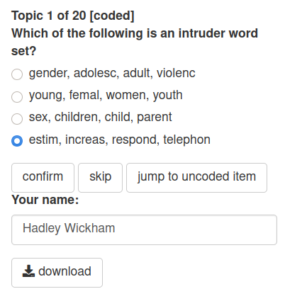

```{r, include = FALSE}
knitr::opts_chunk$set(
  collapse = TRUE,
  comment = "#>"
  )
set.seed(46709394)
```
In oolong 0.3.22, functions for deploying oolong tests were added (`export_oolong`, `revert_oolong` etc.). These functions make it possible for the coders to conduct validation tests online using their browser, rather than having to install R on their computer.

The basic workflow is simple: 1) create the oolong test object as usual; 2) deploy the test online and obtain the URL to the test; 3) ask your coders to conduct the test online and send back the data file; 4) revert back from the data file to an oolong object.

# Create an oolong test

Please note that one cannot deploy oolong test objects with *both* word and topic intrusion tests, i.e. those created using `witi()` online. If you need to do both tests, you need to deploy them as two separate instances: one created using `wi()` and another created using `ti()`.

In this guide, we assume you want to deploy a word set intrusion test online.

```{r}
library(oolong)
wsi_test <- wsi(abstracts_seededlda)
wsi_test
```

# Deploy the test online

First, you need to export the oolong test object as a stand alone Shiny app. This stand alone Shiny app will be in a directory.

```{r}
export_oolong(wsi_test, dir = "./wsi_test", use_full_path = FALSE)
```

The directory has only two files

```{r}
fs::dir_tree("./wsi_test")
```

This structure is called ["Single-file Shiny app."](https://shiny.rstudio.com/articles/app-formats.html) Experienced Shiny users might have their preferred method of deploying this app to whatever Shiny server they can master.

For less experienced users, the simplest way to deploy this app online is to use [shinyapps.io](https://www.shinyapps.io/) (free tier available with 25 hours of computational time per month). Please register for an account at shinyapps.io and configure rsconnect. Please refer to [this guide](https://shiny.rstudio.com/articles/shinyapps.html) for more information. Please remember to configure the tokens.

```r
## replace <ACCOUNT>, <TOKEN>, <SECRET> with the information from your profile on Shinyapps.io: click Your name -> Tokens
rsconnect::setAccountInfo(name="<ACCOUNT>", token="<TOKEN>", secret="<SECRET>")
```

For RStudio users, the simplest way to deploy the app to shinyapps.io is to first launch the app.

```{r, eval = FALSE}
library(shiny)
runApp("./wsi_test")
```

And then click the **Publish** button at the right corner of the launched window.

You will be asked for the title of the app, just give it a name, e.g. *wsi_test*. You probably can keep other default settings and push the **Publish** button to initialize the deployment process.


If there is no hiccup, you will get a URL to your deployed oolong test. Something like: *https://yourname.shinyapps.io/wsi_test/*

# Conduct the test

You can give the URL to your coders and they conduct the test with their browser online. The only difference of the deployed version is that, there will be a userid prompt and download button after the coding.



You should instruct your coders to download the data file after coding and return it to you. ^[Future versions might provide permanent storage]

# Revert

You can then obtain a locked oolong object from the original oolong and the downloaded data file. `revert_oolong` will do verifications with the original oolong object to make sure no error and no cheating.

```{r, include = FALSE}
wsi_test <- readRDS(system.file("extdata", "wsi_test.RDS", package = "oolong"))
```

```r
revert_oolong(wsi_test, "oolong_2021-05-22 20 51 26 Hadley Wickham.RDS")
```

```{r, echo = FALSE}
revert_oolong(wsi_test, system.file("extdata", "hadley.RDS", package = "oolong"))
```

```{r, include = FALSE}
unlink("./wsi_test", recursive = TRUE)
```
